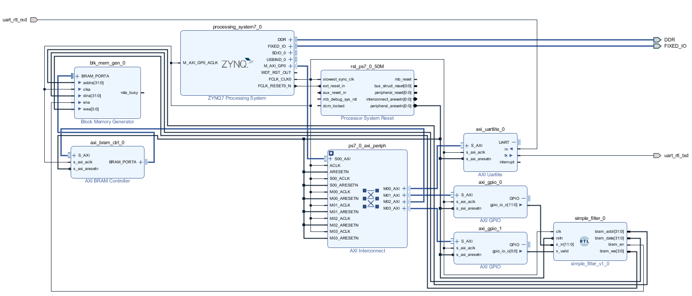
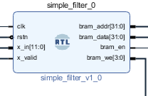
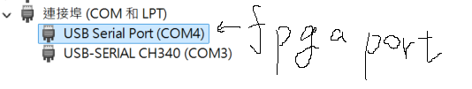
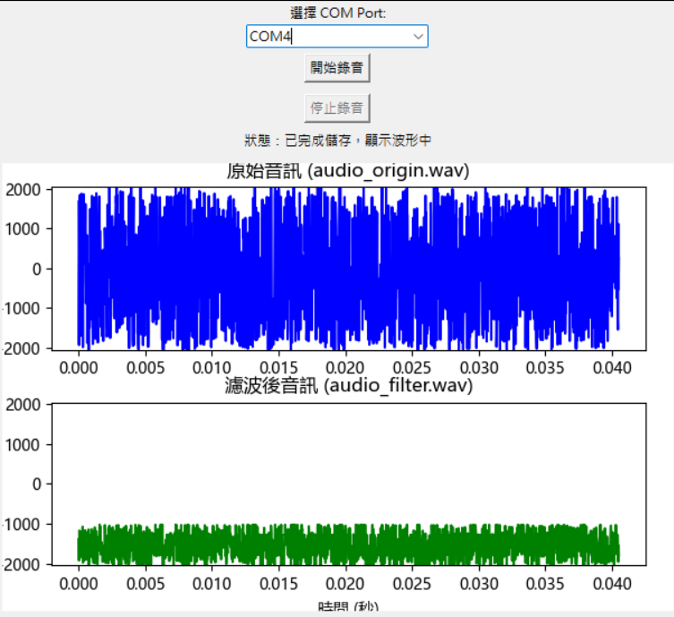

# SoC 期末報告: FPGA以UART 接收麥克風資料並透過 自訂濾波RTL 濾波後暫存於BRAM中 

## 組員及派工

*C111112135 高啟恩(組長)：low pass filter、integrate project
*C111112133 張昌暉：BRAM IP、block design
*C111112168 王冠中：UART IP、Arduino

## 專案簡介

本專案基於 Zynq-7000 SoC 架構，利用 Programmable Logic (PL) 內部自訂 UART 接收器（UART RX IP）接收 Arduino 麥克風傳送的 16-bit 音訊資料（範圍 0~4096）。接收資料後，PL 端進行濾波處理，送至BRAM，再以PC端進行存取後轉成.wav檢查波型。

---

## 系統構成與流程 

1. 麥克風以 I²S 協定傳送音訊資料
2. PL 中的 UART T RX IP 接收資料並輸出至自訂濾波器RTL 進行濾波
3. 音訊資料進入濾波 IP 進行即時濾波處理，再儲存至BRAM

---

## 功能規格

* 支援立體聲 I²S 音訊資料接收
* 音訊資料經過 FIR 濾波器處理（可自訂參數）
* 音訊格式：12-bit PCM，支援單通道或雙通道
* 更新頻率：44kHz 

---

## 硬體介面規格

* I²S 信號輸入：`BCLK`, `LRCLK`, `SDATA`
* PL 實作：UART TRX IP、濾波器 RTL、BRAM GENERATOR
* PS 控制介面：AXI4

---

## 限制與考量

* 音訊來源與時脈（BCLK、LRCLK）須同步一致
* 濾波器延遲需考量（UART 接收延遲)


---

## 驗收準則

* 可透過測試python程式讀取音訊資料(Bram)並顯示波型差異

---

## Breakdown


---

## Block design




## IP 介面與 API 說明

### 1. UART IP（自訂或 Xilinx IP）

| 項目       | 說明                                                                 |
|------------|----------------------------------------------------------------------|
| 輸入介面   | UART RXD 串列接收腳位                          |
| 輸出介面   | 12-bit 串列解碼後的平行資料流                          |
| 功能       | 將 UART 串列數據轉換成資料流，包含起始位、資料位、停止位的解析                 |
| 控制介面   | AXI-Lite（設定包率、啟動、重置等）             |

---

### 2. 濾波器 （FIR 或自訂）

| 項目       | 說明                                                                 |
|------------|----------------------------------------------------------------------|
| 類型       | Verilog RTL                                                      |
| 輸入介面   |  UART RX輸出的 12bit audio data                                 |
| 輸出介面   | 12 bit filtered audio data                                   |
| 功能       | 對音訊數據進行 FIR 濾波處理（如低通、高通、帶通等）                 |
| 參數控制   | 公式 : y[n] = 0.25x[n] + 0.5x[n-1] + 0.25x[n-2]               |


---

### 1. BLOCK_RAM IP（自訂或 Xilinx IP）

| 項目       | 說明                                                                 |
|------------|----------------------------------------------------------------------|
| 輸入介面   | 濾波器所輸出的12bit filter_data                          |
| 輸出介面   | dout[11:0]                          |
| 功能       | 儲存濾波器所輸出之資料，方便PC端讀取                |
| 控制介面   | AXI BRAM CONTROLLER             |

---


## 實作參考

### FIR濾波 RTL

```
y[n] = 0.25x[n] + 0.5x[n-1] + 0.25x[n-2]
```



---

### 定義使用到的IP

```c
#define GPIO_DEVICE_ID XPAR_GPIO_0_DEVICE_ID
#define GPIO_DEVICE_ID1 XPAR_GPIO_1_DEVICE_ID

#define UART_ARDUINO_DEVICE_ID XPAR_UARTLITE_0_DEVICE_ID
#define BRAM_BASE_ADDR XPAR_AXI_BRAM_CTRL_0_S_AXI_BASEADDR
```
---

### 收取UART數據並透過GPIO送至濾波器RTL

```c
uint8_t lsb = XUartLite_RecvByte(UartArduino.RegBaseAddress);  //收取UART數據
while (XUartLite_IsReceiveEmpty(UartArduino.RegBaseAddress));  // 等待下一個 byte
uint8_t msb = XUartLite_RecvByte(UartArduino.RegBaseAddress);  //收取UART數據

uint16_t raw = ((uint16_t)msb << 8) | lsb;
uint16_t value = raw & 0x0FFF;  // 取 12-bit 有效資料;
XGpio_DiscreteWrite(&Gpio, 1, (1 << 12) | (value));             //將數據送至GPIO -> 濾波器RTL
```
---

### PC端讀取BRAM數據(濾波後音訊數據)，以python轉檔wav，輸出波行檢查差異

```c
uint32_t val = Xil_In32(BRAM_BASE_ADDR + b * 4);
xil_printf("filter_Data: %d\r\n", val);
```

### PC端透過FPGA port接收BRAM data以及原始音訊 data
---



---

### 透過python程式檢查濾波前後音訊差異
---



---

### Source code
[sdk .c program](Block_design/final_project/project_1.sdk/fir/src/helloworld.c)


## demo影片

[video link](https://youtu.be/F_cxKk4IzOc)