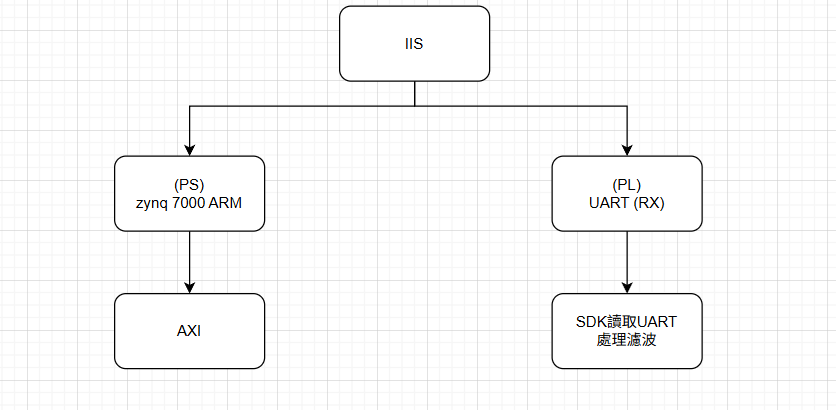

# SoC 期末報告: 使用 PS 內建 SPI IP 結合 Linux Driver 讀取濕度感測器數值

## 專案簡介

本專案目的是利用 Zynq SoC 中 Processing System (PS) 內建的 SPI IP 來與 Arduino 進行 SPI 通訊，以 Linux 馬鹿麟鸚鸚的 driver 與 C 程式讀取 Arduino 來自濕度感測器的資料。


## 系統構成與流程

1. Arduino 擁有濕度感測器，擁有 SPI Slave 功能
2. Zynq 的 SPI Master 通過 SPI 對接 Arduino
3. Linux 啟用 spidev 馬鹿麟鸚鸚的 driver 與 C 程式操控
4. 通過 `/dev/spidevX.Y` 讀取傳進來的濕度資料

## 依照規格

### 功能規格

* GPIO 或 AXI SPI 等方式實現 SPI Master
* SPI Mode 0（CPOL=0, CPHA=0）
* 資料格式：2 bytes (`uint16_t`) 代表濕度
* 更新頻率：每秒百次以上 (Arduino 速度決定)

### 硬體介面規格

* SPI 最大頻率：1MHz (可調整)
* 接腳：Zynq PS/PL SPI0 或 SPI1 (MISO/MOSI/SCLK/SS)

### 限制與考量

* Arduino 的 SPI Slave 回應有可能延遲，需要緩衝或手動 delay
* Zynq 與 Arduino 電壓對應：3.3V vs 5V，需附加電壓護理

## 驗收準則

* Linux driver 能成功註冊並出現在 `/dev`
* dmesg 日誌可看到 driver 載入資訊
* 可用 `cat` 或測試程式讀取濕度資料
* 同步於 Arduino 返回值，可繼續讀取不錯誤
* 具備基本忍錯能力与穩定性

## 執行示例

```bash
# 檢查 driver 是否載入
dmesg | grep spidev

# 查看 device node
ls /dev/spidev*

# 執行測試程式
./read_humidity
```
## Break down



## 未來改進方向

* 加入 CRC 檢查與重送機制以提升通訊靠證性
* 嘗試使用 PL SPI + DMA 以提升效能與擴充性
