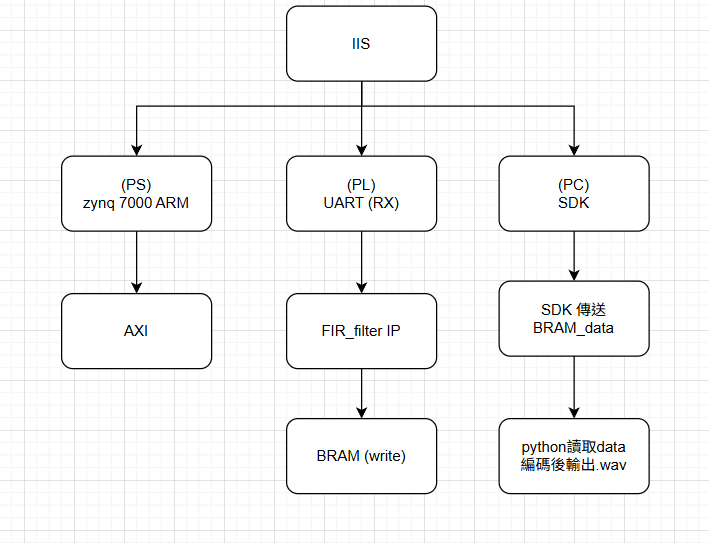

# SoC 期末報告: 自訂 UART 接收麥克風資料於 FPGA

## 專案簡介

本專案基於 Zynq-7000 SoC 架構，利用 Programmable Logic (PL) 內部自訂 UART 接收器（UART RX IP）接收 Arduino 麥克風傳送的 16-bit 音訊資料（範圍 0~4096）。接收資料後，PL 端進行濾波處理。

---

## 系統構成與流程 

1. 麥克風以 I²S 協定傳送音訊資料
2. PL 中的 UART T RX IP 接收資料並輸出 AXI Stream 資料
3. 音訊資料進入濾波 IP 進行即時濾波處理

---

## 功能規格

* 支援立體聲 I²S 音訊資料接收
* 音訊資料經過 FIR 濾波器處理（可自訂參數）
* 音訊格式：16-bit PCM，支援單通道或雙通道
* 更新頻率：48kHz 樣本速率（可調）

---

## 硬體介面規格

* I²S 信號輸入：`BCLK`, `LRCLK`, `SDATA`
* PL 實作：UART TRX IP、濾波器 IP
* PS 控制介面：AXI-Lite

---

## 限制與考量

* 音訊來源與時脈（BCLK、LRCLK）須同步一致
* 濾波器延遲需考量（FIR 阻塞性）

---

## 驗收準則

* 可透過測試程式讀取音訊資料並顯示 sample 值
* 音訊資料連續穩定無遺漏
* 測試不同頻率、濾波器參數仍能穩定運作

---

## Breakdown

---

## Block design

## IP 介面與 API 說明

### 1. UART IP（自訂或 Xilinx IP）

| 項目       | 說明                                                                 |
|------------|----------------------------------------------------------------------|
| 輸入介面   | UART RXD 串列接收腳位                          |
| 輸出介面   | 16-bit 串列解碼後的平行資料流                          |
| 功能       | 	將 UART 串列數據轉換成資料流，包含起始位、資料位、停止位的解析                 |
| 控制介面   | 	AXI-Lite（設定包率、啟動、重置等）             |

---

### 2. 濾波器 （FIR 或自訂）

| 項目       | 說明                                                                 |
|------------|----------------------------------------------------------------------|
| 類型       | python                                                      |
| 輸入介面   | .wav                   |
| 輸出介面   | 濾波後的.wav                   |
| 功能       | 對音訊數據進行 FIR 濾波處理（如低通、高通、帶通等）                |
| 參數控制   | 濾波 Tap 數與係數可由 python中 設定                   |

---

